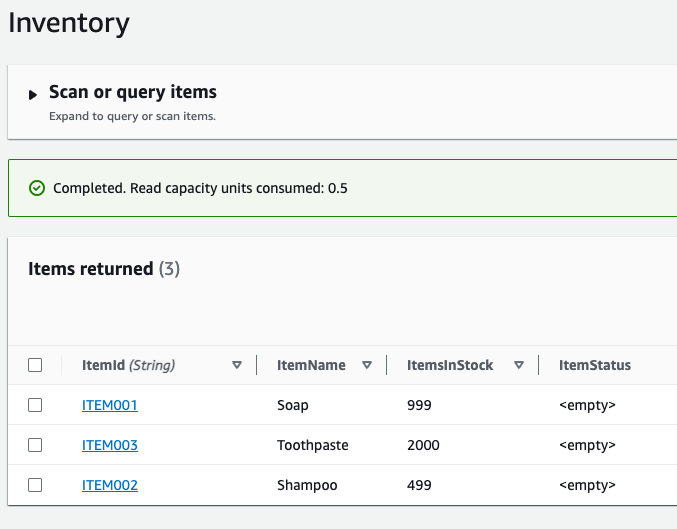

## Build a serverless distributed application in .NET using Saga orchestration pattern 

Saga design pattern can be used to preserve the data integrity with distributed transactions across microservices. The source code in this repo provids sample code for the implementation of the saga orchestration pattern using .NET 6.0 on AWS.  

Blog reference: [https://aws.amazon.com/blogs/compute/building-a-serverless-distributed-application-using-a-saga-orchestration-pattern/](https://aws.amazon.com/blogs/compute/building-a-serverless-distributed-application-using-a-saga-orchestration-pattern/)

## Security

See [CONTRIBUTING](CONTRIBUTING.md#security-issue-notifications) for more information.

## License

This library is licensed under the MIT-0 License. See the LICENSE file.

## Prerequisites

For this walkthrough, you need:
- An [AWS](https://signin.aws.amazon.com/signin?redirect_uri=https%3A%2F%2Fportal.aws.amazon.com%2Fbilling%2Fsignup%2Fresume&client_id=signup) account
- An AWS user with AdministratorAccess (see the [instructions](https://console.aws.amazon.com/iam/home#/roles%24new?step=review&commonUseCase=EC2%2BEC2&selectedUseCase=EC2&policies=arn:aws:iam::aws:policy%2FAdministratorAccess) on the [AWS Identity and Access Management](http://aws.amazon.com/iam) (IAM) console)
- Access to the following AWS services: Amazon API Gateway, AWS Lambda, AWS Step Functions, and Amazon DynamoDB.
- [Node.js](https://nodejs.org/en/download/) installed
- .NET 6.0 SDK installed
- JetBrains Rider or Microsoft Visual Studio 2017 or later (or Visual Studio Code)
- [Postman](https://www.postman.com/downloads/) to make the API call

## Setting up the environment

For this walkthrough, use the [AWS CDK](https://aws.amazon.com/cdk/) code in the GitHub Repository to create the AWS resources. These include IAM roles, REST API using API Gateway, DynamoDB tables, the Step Functions workflow and Lambda functions.

1. You need an AWS access key ID and secret access key for configuring the AWS Command Line Interface (AWS CLI). To learn more about configuring the AWS CLI, follow these [instructions](https://docs.aws.amazon.com/cli/latest/userguide/cli-chap-install.html).
2. Clone the repo:
```bash
git clone https://github.com/aws-samples/saga-orchestration-netcore-blog
```
3. After cloning, this is the directory structure:


4. The Lambda functions in the saga-orchestration directory must be packaged and copied to the cdk-saga-orchestration\lambdas directory before deployment. Run these commands to process the PlaceOrderLambda function:
```bash
cd saga-orchestration
cd PlaceOrderLambda/src/PlaceOrderLambda 
dotnet lambda package
cp bin/Release/netcoreapp3.1/PlaceOrderLambda.zip ../../../../cdk-saga-orchestration/lambdas
```

5. Repeat the same commands for all the Lambda functions in the saga-orchestration directory.

6. Build the CDK code before deploying to the console:
```bash
cd cdk-saga-orchestration/src/CdkSagaOrchestration
dotnet build
```

7. Install the aws-cdk package:
```bash
npm install -g aws-cdk 
```

8. The cdk synth command causes the resources defined in the application to be translated into an [AWS CloudFormation](https://aws.amazon.com/cloudformation/) template. The cdk deploy command deploys the stacks into your AWS account. Run:
```bash
cd cdk-saga-orchestration
cdk synth 
cdk deploy
```
9. CDK deploys the environment to AWS. You can monitor the progress using the CloudFormation console. The stack name is CdkSagaOrchestrationStack:


## The Step Functions configuration

```cs
var stepDefinition = placeOrderTask
    .Next(new Choice(this, "Is order placed")
        .When(Condition.StringEquals("$.Status", "ORDER_PLACED"), updateInventoryTask
            .Next(new Choice(this, "Is inventory updated")
                .When(Condition.StringEquals("$.Status", "INVENTORY_UPDATED"),
                    makePaymentTask.Next(new Choice(this, "Is payment success")
                        .When(Condition.StringEquals("$.Status", "PAYMENT_COMPLETED"), successState)
                        .When(Condition.StringEquals("$.Status", "ERROR"), revertPaymentTask)))
                .When(Condition.StringEquals("$.Status", "ERROR"), waitState)))
        .When(Condition.StringEquals("$.Status", "ERROR"), failState));
```

Compare the states language definition for the state machine with the definition below. Also observe the inputs and outputs for each step and how the conditions have been configured. The steps with type Task call a Lambda function for the processing. The steps with type Choice are decision-making steps that define the workflow.


## Setting up the DynamoDB table

The Orders and Inventory DynamoDB tables are created using AWS CDK. The following snippet creates a DynamoDB table with AWS CDK for .NET:

```cs
var inventoryTable = new Table(this, "Inventory", new TableProps
{
    TableName = "Inventory",
    PartitionKey = new Attribute
    {
        Name = "ItemId",
        Type = AttributeType.STRING
    },
    RemovalPolicy = RemovalPolicy.DESTROY
});
```

You need to create some items in the **Inventory** table to test the saga orchestration pattern: 

1. In the AWS Console, open the  DynamoDB service page, click on Tables in the left pane, and select the Inventory table. 


2. Choose _Create Item_ from the Actions menu.
3. Choose _JSON View_ and switch off the _View DynamoDB JSON_ toggle switch. 

4. Paste the following contents, then choose Save.
```json
{
  "ItemId": "ITEM001",
  "ItemName": "Soap",
  "ItemsInStock": 1000,
  "ItemStatus": ""
}
```
5. Similarly, create two more items into the **Inventory** table.
```json
{
  "ItemId": "ITEM002",
  "ItemName": "Shampoo",
  "ItemsInStock": 500,
  "ItemStatus": ""
}

{
  "ItemId": "ITEM003",
  "ItemName": "Toothpaste",
  "ItemsInStock": 2000,
  "ItemStatus": ""
}
```
The Lambda functions UpdateInventoryLambda and RevertInventoryLambda increment and decrement the ItemsInStock attribute value. The Lambda functions PlaceOrderLambda and UpdateOrderLambda insert and delete items in the Orders table. These are invoked by the saga orchestration workflow.

## Triggering the saga orchestration workflow

The API Gateway endpoint, _SagaOrchestratorAPI_, is created using AWS CDK. To get the invoke URL, go to the CloudFormation outputs page and copy the value of the output variable, SagaOrchestratorAPIEndpoint.


1. From Postman, open a new tab. Select POST in the dropdown and enter the copied URL in the textbox. Move to the Headers tab and add a new header with the key ‘Content-Type’ and value as ‘application/json’:


2. In the Body tab, enter the following input and choose Send.
```json
{
  "ItemId": "ITEM001",
  "CustomerId": "ABC/002",
  "MessageId": "",
  "FailAtStage": "None"
}
```
3. You see the output:


4. Open the [Step Functions console](https://console.aws.amazon.com/states/home) and view the execution. The graph inspector shows that the execution has completed successfully.


5. Check the items in the DynamoDB tables, Orders & Inventory. You can see an item in the Orders table indicating that an order is placed. The ItemsInStock in the Inventory table has been deducted.


6. To simulate the failure workflow in the saga orchestrator, send the following JSON as body in the Postman call. The FailAtStage parameter injects the failure in the workflow. Select Send in Postman after updating the Body:

```json
{
  "ItemId": "ITEM002",
  "CustomerId": "DEF/002",
  "MessageId": "",
  "FailAtStage": "UpdateInventory"
}
```
7. Open the Step Functions console to see the execution.
8. While the function waits in the wait state, look at the items in the DynamoDB tables. A new item is added to the Orders table and the stock for Shampoo is deducted in the Inventory table.



9. Once the wait completes, the compensatory transaction steps are run:


10. In the graph inspector, select the Update Inventory step. On the right pane, click on the Step output tab. The status is ERROR, which changes the control flow to run the compensatory transactions.


11. Look at the items in the DynamoDB table again. The data is now back to a consistent state, as the compensatory transactions have run to preserve data integrity:


The Step Functions workflow implements the saga orchestration pattern. It performs the coordination across distributed services and runs the transactions. It also performs compensatory transactions to preserve the data integrity.

## Cleaning up

To avoid incurring additional charges, clean up all the resources that have been created. Run the following command from a terminal window. This deletes all the resources that were created as part of this example.

```bash
cdk destroy
```
